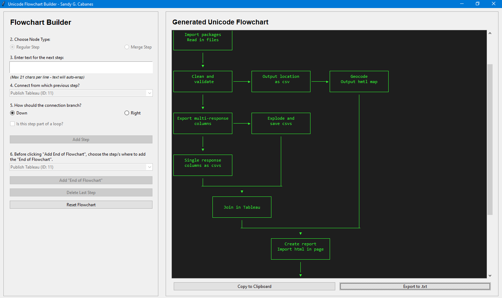

# Unicode Flowchart Builder App
## Python

A lightweight, Tkinter-based GUI for creating Unicode flowcharts — no browser, no complex diagramming tools, just instant, portable text diagrams.
## 

---

## Why This Exists
- Creating flowcharts in draw.io or Mermaid is slow and requires browser rendering.
- Needed a fast, shareable, text-based diagram format for workflows, algorithms, and pipelines.
- Unicode characters make diagrams portable — they work in plain text, emails, code comments, and documentation.

---

## What It Does
- Builds flowcharts from text input — no manual drawing.
- Automates layout — you define steps, connections, and loops; the app handles spacing and alignment.
- Exports anywhere — copy to clipboard or save as `.txt` for universal compatibility.

---

## How It Works
1. Add Steps  
   - Choose Regular Step or Merge Step.  
2. Define Connections  
   - Select the source step and branch direction (Down or Right).  
3. Handle Loops  
   - If part of a loop, add a label showing where it returns.  
4. Generate Output  
   - App renders a Unicode flowchart instantly.
     

---

## Key Features
- GUI built with Tkinter — no external dependencies.
- Unicode-based rendering — works in any text environment.
- Loop-friendly — uses text labels instead of arrows for clarity.
- Audit-friendly — output is plain text, easy to version-control.

---

## Example Use Cases
- Documenting code workflows.
- Outlining data pipelines.
- Creating process diagrams for reports.
- Embedding diagrams in AI-assisted coding prompts.

---

## Design Choices
### These are the decisions I made to balance simplicity with usefulness.
- No loop arrows — replaced with labeled loop text for simplicity and readability.
- Add loops manually after creating txt file.
- Two arrow directions - Down and right only for simplicity.
- Merge step is included for two flows
- Portable output — `.txt` ensures diagrams survive copy-paste across platforms.

---

## Background
Built to speed up workflow documentation.  
Instead of wrestling with browser-based tools, this provides a local, instant, reproducible way to create diagrams that can live in:
- GitHub READMEs
- Audit documentation
- Plain-text project notes

---

Block Diagram of [Workflow](https://github.com/SandyGCabanes/Unicode-Flowchart-Builder-App/blob/main/workflow.txt)

>SGC. Data-Powered Decisions.
